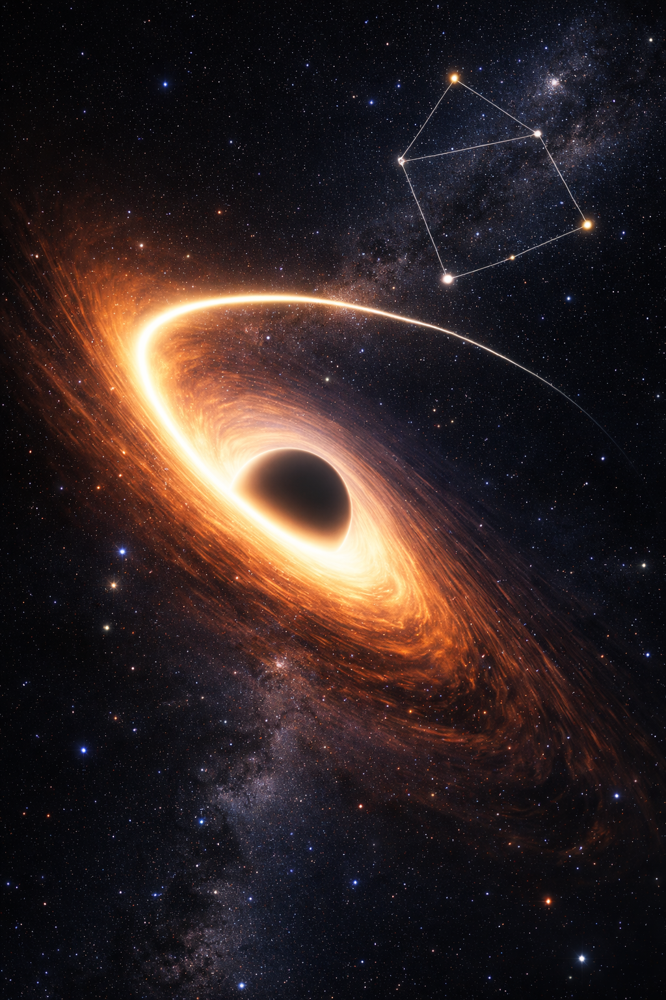

# Failure of Simultaneity
*Measured apart, felt together.*

Across the fabric of spacetime, something began to accelerate— 
interactions settling into orbit, 
collapsing distance into convergence. 
Time refused to align, 
and through the quantum stillness in between, 
you exerted a gravitational pull—distant, yet inevitable, 
a light drawn past the point of escape.

— LB Hurtado  
© 2026 LB Hurtado. All rights reserved.
